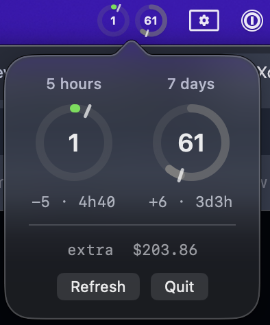

# Claude Usage Bar

A lightweight macOS menu bar app that monitors your Claude API usage in real-time.



## Features

- **Two ring gauges** in the status bar: 5-hour and 7-day usage windows
- **Drift visualization**: green (under pace), orange (>+10%), red (>+30%)
- **Tick marks** showing elapsed time position in each window
- **Popover** with large gauges, drift details, and reset timers
- **Extra usage** cost displayed when a window reaches 100%
- Reads OAuth token from macOS Keychain (Claude Code credentials)
- Auto-refreshes every 60 seconds

## Build

```
make
open build/ClaudeUsageBar.app
```

## Install

```
make install
```

Copies the app to `/Applications`.
